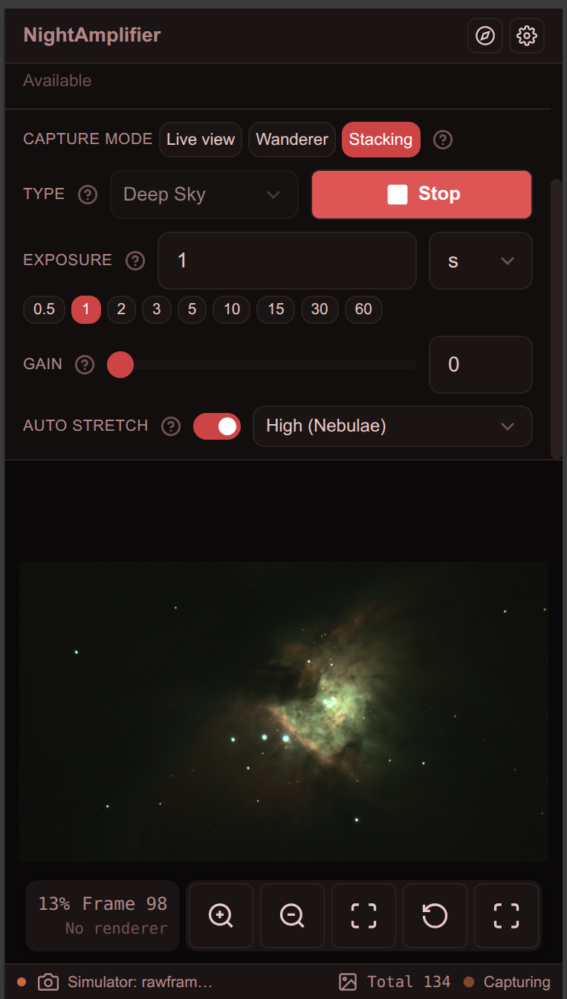
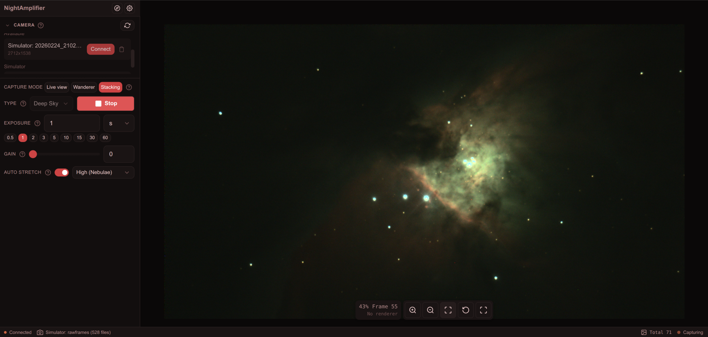

# Night Amplifier

Live stacking Web application for Electronically Assisted Astronomy - https://skycontrast.com/software/night-amplifier

|                                Mobile View                                |                             Desktop View                             |
|:-------------------------------------------------------------------------:|:--------------------------------------------------------------------:|
|  |  |

## Supported Platforms

| OS                        | Architecture | Supported                                                 |
|---------------------------|--------------|-----------------------------------------------------------|
| Linux                     | x86_64       | ✅                                                         |
| Linux                     | ARM64        | ✅                                                         |
| Raspberry Pi5, Orange Pi5 | ARM64        | ✅                                                         |
| Windows                   | x86_64       |  |
| Windows                   | ARM64        |  |
| macOS                     | x86_64       |  |
| macOS                     | ARM64        |  |

[](https://github.com/Nikita-Kudrin/night-amplifier/actions/workflows/ci.yml)

## Camera SDK Support

The camera module uses a dynamic runtime loading system. Camera SDKs are **optional runtime dependencies**. If an SDK is
not installed on your system, the binary will still run perfectly, but that specific camera brand will simply be
disabled.

Enable features for specific manufacturers when compiling:

| Provider       | SDK Required                                                         | Supported                                                 |
|----------------|----------------------------------------------------------------------|-----------------------------------------------------------|
| Player One     | [Player One SDK](https://player-one-astronomy.com/service/software/) | ✅                                                         |
| ZWO (ASI)      | [ZWO ASI SDK](https://astronomy-imaging-camera.com/software-drivers) |  |
| INDI           | *Planned*                                                            |  |
| Touptek        | *Planned*                                                            |  |
| QHYCCD         | *Planned*                                                            |  |
| SVBony         | *Planned*                                                            |  |
| Altair Astro   | *?*                                                                  | ...                                                       |
| Atik           | *?*                                                                  | ...                                                       |
| USB web camera | *?*                                                                  | ...                                                       |
| Simulated      | Loads PNG/TIFF/FITS/SER from directories                             | ✅                                                         |

## Features

- **Stacking modes** - Deep Sky, Planetary () .
- **Background subtraction** - Standard grid-based model to remove light pollution gradients.
- **Auto stretching** - Color-preserving stretch with automatic background neutralization.
- **Cooled camera control** - Target-temperature setpoint, live sensor temperature/cooler-power, monitoring,
  rate-limited pre-cooling and warming-up (5 °C/min) to reduce mechanical stress and condensation risk

> [!NOTE]
> Pro features are available in the 'Night Amplifier Pro' version:
> - **Push-To Navigation System** (via ASTAP) - 
> - **Comet Stacking** - 
> - **Advanced Outlier Rejection** (Sigma Clipping)
> - **RBF Background Extraction**

## Frame Storage

Captured frames are automatically saved to FITS files when the "Save Frames to Disk" setting is enabled (default: on).

**Image Storage Formats:**

| Output                  | Format | Bit Depth       |
|-------------------------|--------|-----------------|
| Raw frames              | FITS   | 16-bit unsigned |
| Stacked image           | FITS   | 32-bit float    |
| Stacked image (preview) | PNG    | 8-bit           |
| Planetary frames        | SER    | 16-bit unsigned |

**Directory Structure:**

```
captures/
├── raw/
│   └── DD-MM-YYYY_HH-MM-SS/     # Session directory (timestamp when capture started)
│       ├── frame_000001.fits    # Individual raw frames
│       ├── frame_000002.fits
│       └── ...
└── stacked/
    └── DD-MM-YYYY_HH-MM-SS.fits # Final stacked result (same name as session)
```

**FITS Metadata:** Each file includes standard FITS headers:

- `EXPTIME` / `EXPOSURE` - Exposure time in seconds
- `GAIN` - Camera gain setting
- `OFFSET` - Camera offset (black level)
- `INSTRUME` - Camera name
- `DATE-OBS` - ISO 8601 timestamp
- `FRAMENUM` - Frame number in sequence
- `NCOMBINE` - Number of stacked frames (for stacked results)
- `XBINNING` / `YBINNING` - Binning factor
- `CCD-TEMP` - Sensor temperature in Celsius (cooled cameras only)
- `SET-TEMP` - Target sensor temperature in Celsius (cooled cameras only)
- `SOFTWARE` - "Night Amplifier"

**Slow Disk Warning:** If disk I/O can't keep up with the capture rate, a warning appears in the web interface when the
write queue exceeds 5 frames. The queue depth is shown to help diagnose performance issues.

## Distribution Builds

Night Amplifier can be built as a self-contained single binary with the web UI embedded.
No external files are needed to run the distribution binary.

### Pre-built Downloads

Pre-built binaries are available on the [Releases](https://github.com/Nikita-Kudrin/night-amplifier/releases) page
for Linux x86_64 and ARM64 (including optimized builds for Raspberry Pi 5 / Orange Pi 5).

For the easiest installation on desktop Linux, download the `.AppImage` file, make it executable, and double-click to
run.

Alternatively, download the `.tar.gz` archive for your platform, extract, and run:

```bash
tar xzf night-amplifier-*.tar.gz
cd night-amplifier-*/
./night-amplifier          # Default port 8080
./night-amplifier 3000     # Custom port
```

### Building Locally

Local builds are optimized for your specific CPU architecture (`-C target-cpu=native`),
which is critical for maximum performance on devices like Raspberry Pi 5 or Orange Pi 5.

```bash
./scripts/build-dist.sh
```

The archive is created in `dist/`. Extract and run `./night-amplifier`.

### Cross-compile for ARM64

```bash
# Requires: cargo install cross
./scripts/build-dist.sh --cross --target aarch64-unknown-linux-gnu --target-cpu cortex-a76
```

### Build Options

| Flag                 | Description                          |
|----------------------|--------------------------------------|
| `--target <triple>`  | Rust target triple (default: host)   |
| `--target-cpu <cpu>` | CPU optimization (default: `native`) |
| `--cross`            | Use `cross` for cross-compilation    |
| `--no-frontend`      | Skip web frontend build              |
| `--appimage`         | Also create an AppImage              |

## Building from Source

```bash
cargo build

cargo build --release
```

## Running Tests

```bash
cargo test
```

#### Player One Setup

**Runtime Prerequisites (Optional):**

To use Player One cameras, you must install the following system libraries:

- **libusb-1.0**: Required by the Player One SDK
  ```bash
  # Debian/Ubuntu/Raspberry Pi OS
  sudo apt-get install libusb-1.0-0

  # Fedora
  sudo dnf install libusb-1.0

  # Arch Linux/Manjaro
  sudo pacman -S libusb
  ```
- **libclang**: Required for bindgen to generate Rust bindings
  ```bash
  # Debian/Ubuntu/Raspberry Pi OS
  sudo apt-get install libclang-dev

  # Fedora
  sudo dnf install clang-devel

  # Arch Linux/Manjaro
  sudo pacman -S clang
  ```

**Linux Installation:**

1. Download the SDK from [Player One Software](https://player-one-astronomy.com/service/software/)
2. Extract the archive and install udev rules (for USB permissions):
   ```bash
   sudo install 99-player_one_astronomy.rules /lib/udev/rules.d/
   sudo udevadm control --reload-rules
   sudo udevadm trigger
   ```
3. Install the shared library:
   ```bash
   sudo cp libPlayerOneCamera.so /usr/local/lib/
   sudo ldconfig
   ```
4. Unplug and replug the camera after installing udev rules

**Verification:**

```bash
# Check if library is found
ldconfig -p | grep PlayerOne

# Build with Player One support
cargo build --release --features playerone
```

#### ZWO Setup

**Runtime Prerequisites (Optional):**

To use ZWO ASI cameras, you must install the following system libraries:

- **libusb-1.0**: Required by the ZWO ASI SDK
  ```bash
  # Debian/Ubuntu/Raspberry Pi OS
  sudo apt-get install libusb-1.0-0

  # Fedora
  sudo dnf install libusb-1.0

  # Arch Linux/Manjaro
  sudo pacman -S libusb
  ```

**Linux Installation:**

1. Download the SDK from [ZWO Software & Drivers](https://astronomy-imaging-camera.com/software-drivers)
2. Extract the archive and install udev rules (for USB permissions):
   ```bash
   sudo install lib/asi.rules /lib/udev/rules.d/
   sudo udevadm control --reload-rules
   sudo udevadm trigger
   ```
3. Install the header file (required for building):
   ```bash
   sudo cp include/ASICamera2.h /usr/local/include/
   ```
4. Install the shared library (for x64):
   ```bash
   sudo cp lib/x64/libASICamera2.so /usr/local/lib/
   sudo ldconfig
   ```
   For ARM (Raspberry Pi):
   ```bash
   sudo cp lib/armv8/libASICamera2.so /usr/local/lib/
   sudo ldconfig
   ```
5. Unplug and replug the camera after installing udev rules

**Verification:**

```bash
# Check if library is found
ldconfig -p | grep ASICamera

# Build with ZWO support
cargo build --release --features zwo

# Build with both Player One and ZWO support
cargo build --release --features playerone,zwo
```

### Web Server

The integrated web server provides remote camera control and live image streaming.

```bash
# Run the server (default port 8080)
cargo run --release

# Run on a custom port
cargo run --release -- 3000

# Run with OpenTelemetry tracing enabled
cargo run --release --features telemetry -- --telemetry
```

The server provides:

| Endpoint                       | Method | Description                       |
|--------------------------------|--------|-----------------------------------|
| `/api/cameras`                 | GET    | List available cameras            |
| `/api/cameras/{id}/connect`    | POST   | Connect to a camera               |
| `/api/cameras/{id}/disconnect` | POST   | Disconnect from a camera          |
| `/api/cameras/{id}`            | GET    | Get camera info                   |
| `/api/capture/start`           | POST   | Start capture session             |
| `/api/capture/stop`            | POST   | Stop capture session              |
| `/api/capture/status`          | GET    | Get capture status                |
| `/api/settings`                | GET    | Get current settings              |
| `/api/settings`                | POST   | Update settings                   |
| `/ws/stream`                   | WS     | Live image stream (binary frames) |
| `/ws/events`                   | WS     | Server events (JSON)              |

> [!IMPORTANT]
> The following endpoints require the **Night Amplifier Pro** plugin to be installed and configured:

| Endpoint                      | Method | Description                       |
|-------------------------------|--------|-----------------------------------|
| `/api/push-to/status`         | GET    | Get Push-To navigation status     |
| `/api/push-to/target`         | POST   | Set target by name or coordinates |
| `/api/push-to/target`         | DELETE | Clear current target              |
| `/api/push-to/direction`      | GET    | Get push direction to target      |
| `/api/push-to/catalog/search` | GET    | Search object catalog             |
| `/api/astap/status`           | GET    | Get ASTAP installation status     |
| `/api/astap/install`          | POST   | Start ASTAP installation          |
| `/api/catalog/status`         | GET    | Get OpenNGC catalog status        |
| `/api/catalog/install`        | POST   | Start OpenNGC catalog install     |

Static files are served from the `web/` directory (Vue 3 frontend included).

#### Adding New Camera Providers

To add support for a new camera manufacturer:

1. Create a new module in `src/camera/` (e.g., `zwo.rs`)
2. Implement the `Camera` trait for your camera handle
3. Implement the `CameraProvider` trait for discovery/factory
4. Add the feature flag to `Cargo.toml`
5. Register in `CameraRegistry::register_defaults()`

### OpenTelemetry

Night Amplifier supports optional OpenTelemetry integration for distributed tracing and metrics, useful for debugging
and
performance monitoring.

**Building with telemetry support:**

```bash
cargo build --release --features telemetry
```

**Running with telemetry:**

```bash
# Enable with default OTLP endpoint (http://localhost:4317)
cargo run --release --features telemetry -- --telemetry

# Specify custom OTLP endpoint (e.g., remote collector)
cargo run --release --features telemetry -- --telemetry --otlp-endpoint http://192.168.1.100:4317

# Disable telemetry explicitly (even if built with the feature)
cargo run --release --features telemetry -- --no-telemetry
```

**Environment variables:**

| Variable                      | Default                 | Description             |
|-------------------------------|-------------------------|-------------------------|
| `OTEL_EXPORTER_OTLP_ENDPOINT` | `http://localhost:4317` | OTLP collector endpoint |
| `OTEL_SERVICE_NAME`           | `night-amplifier`       | Service name in traces  |

**Running the full observability stack (traces + metrics):**

The project includes a Docker Compose file that starts Jaeger (traces), OpenTelemetry Collector, Prometheus (metrics),
and Grafana (dashboards):

```bash
docker compose -f docker-compose.telemetry.yml up -d
```

Then start the server with telemetry enabled (sends to `localhost:4317` by default):

```bash
cargo run --release --features telemetry -- --telemetry
```

**Where to view telemetry data:**

| URL                        | What you see                                                       |
|----------------------------|--------------------------------------------------------------------|
| **http://localhost:16686** | Jaeger UI — distributed **traces** (spans, request timelines)      |
| **http://localhost:9090**  | Prometheus UI — raw **metrics** queries (gauges, counters)         |
| **http://localhost:3000**  | Grafana UI — **metric dashboards** and graphs (login: admin/admin) |

> **Traces vs Metrics:** Jaeger only shows traces (spans). To view gauges such as
> `master_stack.memory_bytes` or `disk_writer.queue_depth`, use Prometheus or Grafana.

To query a metric in Prometheus, open http://localhost:9090 and type the metric name
(dots are converted to underscores, e.g. `master_stack_memory_bytes`).

### Web Frontend

A Vue 3 web interface is included for camera control from any browser (desktop or mobile).

```bash
# Install dependencies
cd web
npm install

# Development server (proxies API to localhost:8080)
npm run dev

# Production build (outputs to web/dist/)
npm run build

# Run tests
npm test          # Watch mode
npm run test:run  # Single run

# Linting and formatting
npm run lint      # Check for issues
npm run lint:fix  # Auto-fix ESLint issues
npm run format    # Format with Prettier
```

**Note:** All npm commands must be run from the `web/` directory.

**Features:**

- Mobile-first responsive design (phone + desktop)
- Real-time WebSocket streaming (RGB8+LZ4 for high performance and compatibility)
- WebGL-accelerated image rendering with Canvas2D fallback
- Touch support with pinch-to-zoom on live view
- Push-To navigation panel for manual telescope pointing (Available in Pro version)
- Comet Stacking specialized tracking and nucleus alignment (Available in Pro version)
- Dark theme optimized for night use

For production deployment, run `npm run build` then start the Rust server - it automatically
serves the built frontend from `web/`.

## License

Copyright (c) 2026- Nikita Kudrin (+ Night Amplifier contributors)

Licensed under GNU Affero General Public License as stated in the LICENSE:

Copyright (c) 2026- Nikita Kudrin & other Night Amplifier contributors

This program is free software: you can redistribute it and/or modify it under
the terms of the GNU Affero General Public License as published by the Free
Software Foundation, either version 3 of the License, or (at your option) any
later version.

This program is distributed in the hope that it will be useful, but WITHOUT
ANY WARRANTY; without even the implied warranty of MERCHANTABILITY or FITNESS
FOR A PARTICULAR PURPOSE. See the GNU Affero General Public License for more
details.

You should have received a copy of the GNU Affero General Public License along
with this program. If not, see https://www.gnu.org/licenses/